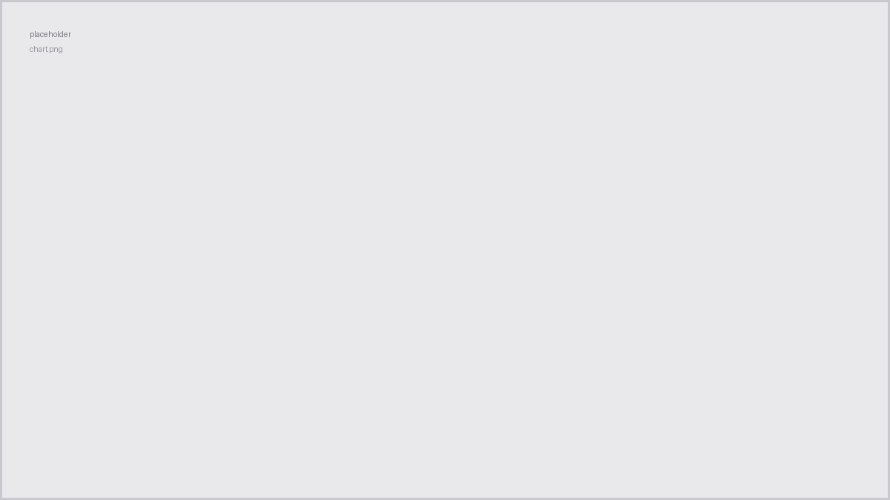

Enough shots logged to plot rating against extraction time.

Turns out my best shots cluster tighter around a specific ratio than I expected, and grind setting mattered less than dose consistency. Which is either a real finding or a sign my scale needs replacing.
