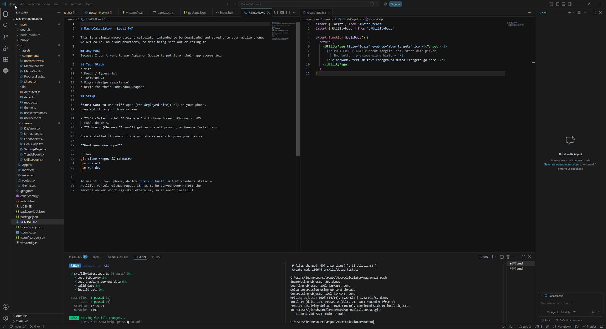

I specced out the application with Claude. Claude helped me figure out the best way to go about making it a PWA with Dexie to save money on database storage, especially for data like this. Originally I was going to go with Supabase because it is what I know, but I realized I didn't have to. Doing Dexie instead also made it so I didn't have to worry about my instances spinning down since it relied strictly on my phone's storage.

