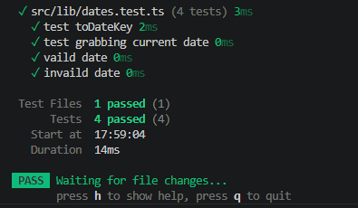

I had Claude review the code that I had worked on. Claude stated that there were some bugs but I didn't want it to tell me straight up how to fix it. I just said point it out and I'll get to work. I installed Vitest and set up some basic unit tests to help figure out what was happening, specifically with the dates. I always forget the dates in JavaScript are kind of finnicky compared to C#. I also learned that there are a lot of things I keep missing with Tailwind syntax such as needing to make sure spaces in the text go where they need to go, such as performing a max() function inside of a class.

