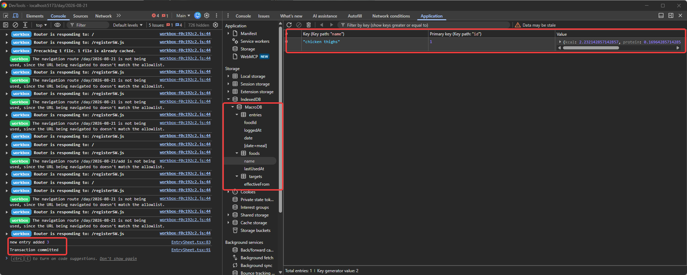

This one took a little bit of time and practice to get used to the ide of useStates, etc. I'm sure there is a better way than writing 9+ useStates on a component, but for now, this is what I am going to do as I get used to everything. After I created the DB, I needed to make the form to start adding data to it. With Tailwind and Claude, I created the UI from the Figma design. Then, I went and did the rest with little-to-no AI-assistance so I can get used to syntax. 

Using the interfaces made in the previous milestone, I was able to build out the "Food" and "Entry" objects that I then used Dexie's transaction to commit it to the database. 

