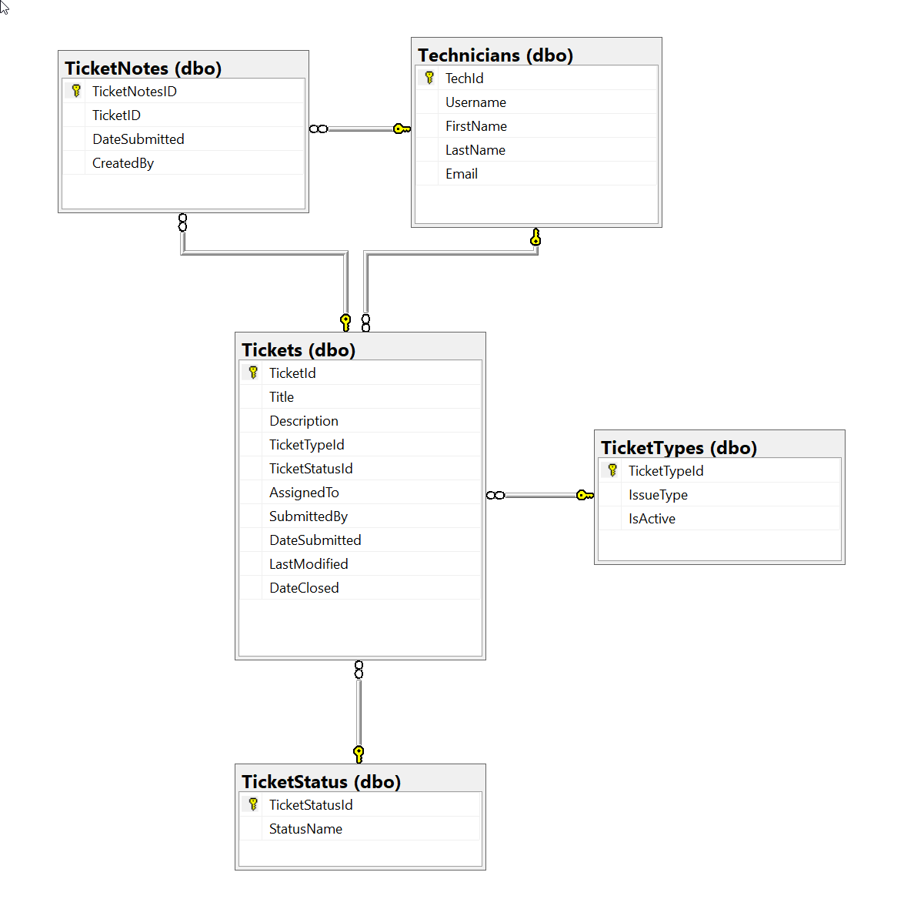

I met up with two colleagues that are both IT Technicians looking to level up their skills and transition into software development. We needed a project that would teach the basics of **CRUD** operations while resulting in something practical and usable.

We landed on building a custom **Ticketing System**. They already know how one functions due to their work, but building it from scratch is entirely new territory. 

Since they are brand new to development, I wanted to start at the data layer to show them how information actually flows. Here is a breakdown of our first session:

* **Database Fundamentals:** We hopped on a **Discord** screen-share to break down the core concepts of relational databases from the ground up.
* **Whiteboarding the ERD:** We mapped out how the data connects and discussed the "why" behind the architecture, specifically covering:
    * **Primary & Foreign Keys:** How tables (like tickets and technicians) relate and are constrained to one another.
    * **Data Integrity:** The reasoning behind specific data types (like strings) and when to use `NULL` vs. `NOT NULL`.
    * **Normalization:** The philosophy behind relational design, such as why we spin off a dedicated `TicketStatuses` lookup table even if it only holds two columns.
* **Writing the SQL:** Once the theory made sense, we worked together to write the actual **SQL** statements to build out the database schema.

