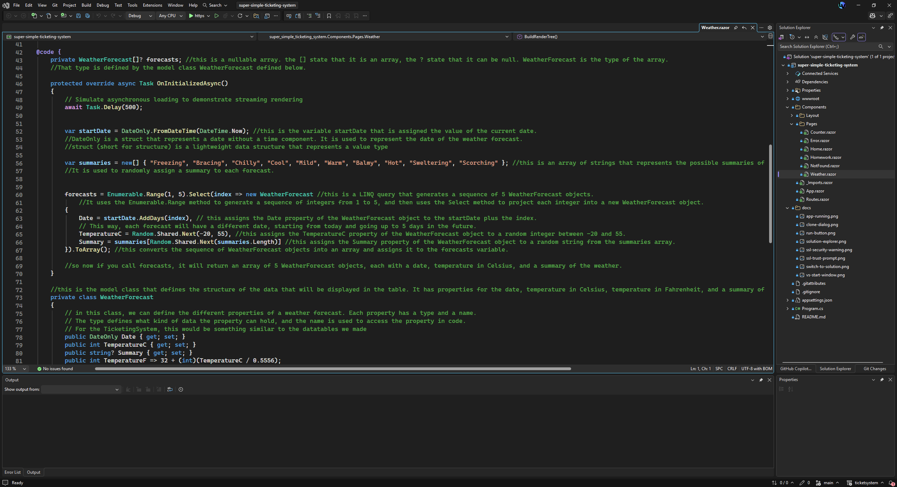

The goal for today was to scaffold them a demo project which we will use later. I created the project repository for them on Github and pushed the demo on there.

## What I set up

- Created the GitHub repo: `super-simple-ticketing-system`
- Scaffolded a Blazor Web App on .NET 10, Server interactivity, per page/component
- Kept the sample pages in on purpose — Counter and Weather are useful reference material for people who have never touched Razor
- Bootstrap 5 ships with the template, so they can start styling immediately with no setup

## Teaching material

- Commented `Weather.razor` line by line — what the `@code` block is, what the model class does, how the foreach builds the table rows
- Added a `Homework.razor` page with the actual assignment on it
- Wrote a long comment at the top of `Homework.razor` explaining render modes, since the silent dead button is the #1 thing that will stall them
- Put a checkbox progress tracker at the bottom of that page. It doubles as a live `@bind` and `@if` example they can crib for the assignment

## The homework

- **Part 1:** restyle the Home page with Bootstrap. Markup only, no C#
- **Part 2:** new page with a textbox and a button that greets you by name. Greeting renders on the page, not in a popup — a JS alert would mean interop, which is too big a jump for lesson one
- Stretch goals go up to the popup version, so there's somewhere to go if anyone finishes early

## README

- Rewrote it around the Visual Studio GUI. No terminal at all — clone, run, branch, commit, push, all through the UI
- Documented the certificate prompts and the folder-view-vs-solution thing, since both look like something is broken when it isn't
- Made branching and pushing an explicit requirement. Three commits minimum, on their own branch, pushed
- Pulled the screenshots out of my old Google Doc into `/docs` as real files. GitHub strips base64 images out of markdown so the embedded ones would not have rendered

## Decisions

- **No Entity Framework.** Going with DTOs and Dapper instead so they write the SQL themselves
- **No database yet.** They get the scaffold to break first. Connection strings and schema come later
- **API after the Blazor app**, once the service layer exists — adding endpoints on top of it makes the point better as a refactor than as an upfront design
- **React dashboard after that**, for practice against the API

## Next

- Get everyone cloned, running, and pushed to their own branch
- Review the homework
- Start on the ticket schema and wiring up Dapper