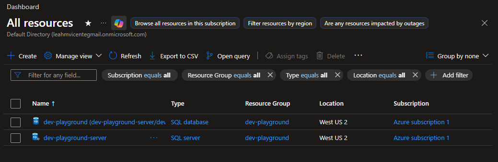

I’m helping a few coworkers build their first full-stack CRUD application for their GitHub portfolios. To get the project started, I wanted to start with the database.

Here is a quick breakdown of how I tackled the initial database setup:

* **Choosing the Platform:** After weighing the options, I decided to go with an **Azure SQL Database** for our cloud hosting.
* **Laying the Groundwork:** Spun up a fresh Azure subscription and created a dedicated development resource group to keep our environments clean and organized.
* **Provisioning the Server:** Deployed the **Azure SQL Server** resource directly into the new dev group.

