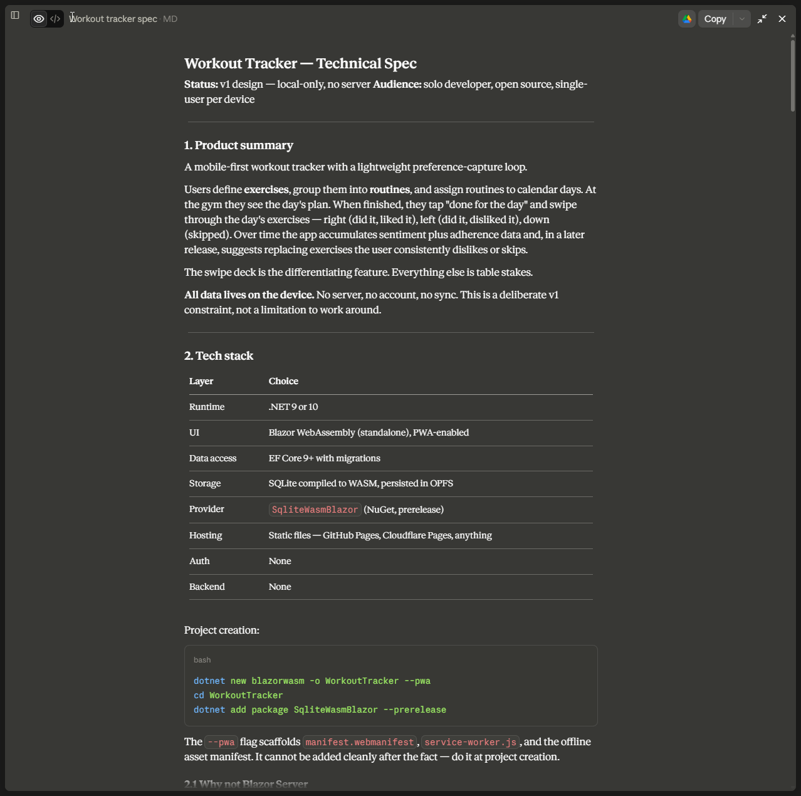

I wanted an application that helped me track my workouts. I felt myself getting to the gym, once really motivated, now I feel like I'm just doing the motions and don't feel bad about skipping workouts. To help get myself back on my gym flow, I decided the first step was to make sure everything was tracked.

I put the idea into Claude and wrote my initial idea of how the app would work, including the UX workflows, who the user is (me), and that I wanted it to be on my phone without being a native app (to avoid having to pay the $99 Apple Developer fee). 

